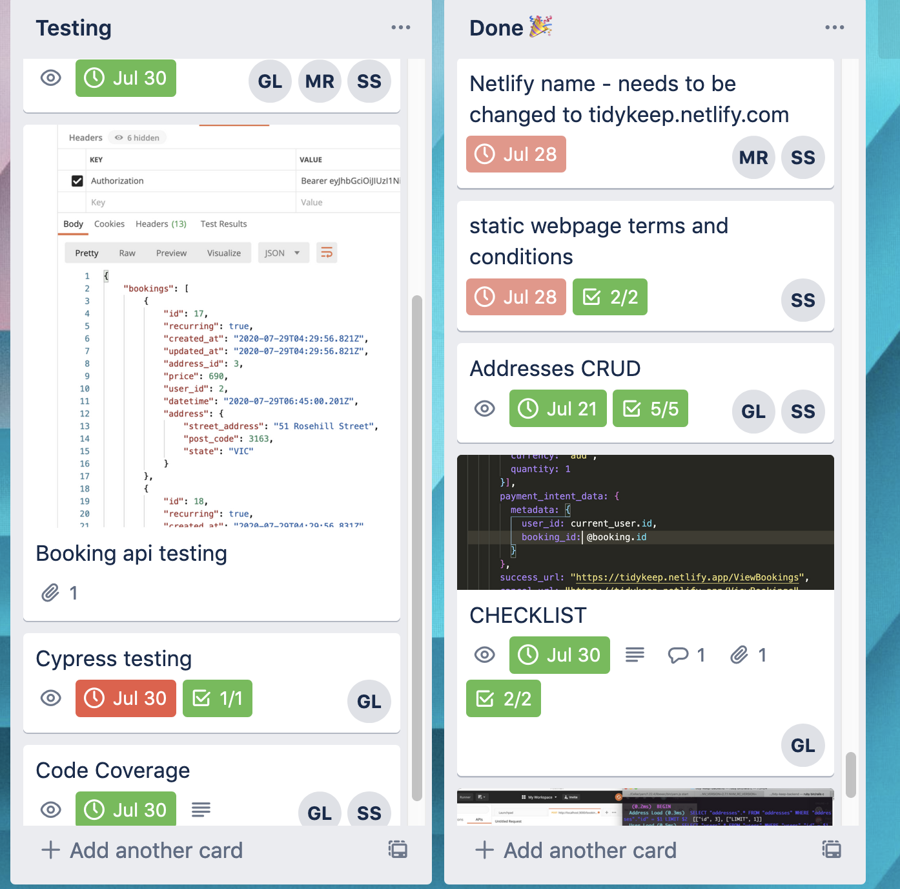

Github repo’s 
Back end - Rails API
https://github.com/GorginZ/tidy-keep-backend

Front end - React Client
https://github.com/Hexicans96/tidy-keep-client

Link to deployed website
https://tidykeep.netlify.app/

Link to manual testing spreadsheets 

https://docs.google.com/spreadsheets/d/1haF-AFo3xtEwotU5Yq5CDBFyMki2CwunRAfpxDdOND8/edit?usp=sharing


How to set up

Rails - API 

Inside of your terminal, change into the root directory of the rails api.
$ EDITOR='code --wait' rails credentials:edit. (this will create a credentials file)
Open the config/master.key file
Paste this key in it ‘594e7b2acb2603368b2dd6cbefac2f25’

$ bundle install

$ rails db:reset (Will drop and existing database, then create, seed and migrate a new one)

$ rails s

Credentials for seeded data
Username : Admin@gmail.com
Password : password


React - Client

Inside of your terminal, change into the root directory of the react client

Open the client in the editor of your choice
Inside of the root directory create a .env file
Paste this code inside of it
```
REACT_APP_API=https://rocky-dusk-81877.herokuapp.com
```
Create a .env.development file
Paste this code inside of it
```
PORT=8080

REACT_APP_API=http://localhost:3000
```

Create a netlify.toml file
Paste this code inside of it
```
[[redirects]]
  from = "/*"    
  to = "/index.html"
  status = 200
```

$ yarn start


Libraries 

Front end 

Development/Production
React
This is definitely the biggest library we use, it is essentially the foundation on which we build our app. Most of the code written in the client side of our app will be using this library.
Moment
	Moment is a library that makes dates and times easier to manipulate than with the standard javascript methods, we mainly use it for the calendar and time selector components. But is also used to store the date/time in the database.
ReactBigCalendar
	ReactBigCalendar is a library that’s primary use is rendering a calendar to the page we were also planning on using it to render events but was scrapped due to lack of resources. It is used for the user to select the date on which they would like to book a clean.
DatePicker
DatePicker is a date/time picking library, we have used it in conjunction with the ReactBigCalendar library so the user may also select a time in their booking. This component handles the time selection, as well as passing the information to state.
 React Semantic UI 
React Semantic UI is a CSS library, that allows us to maintain a consistency across all our many elements in our different components. This is responsible for most of the styling on our website
Stripe
Stripe is a library that is used to handle user payments, it is a high profile library that enables us to securely use customers credit card details with the peace of mind knowing they will be securely handled by stripe.
React-router-dom
React-router-dom is a library that when used in conjunction with react will handle the navigation throughout our website as well as rendering the appropriate component at the appropriate address.
Testing
Cypress


Linting
Prettier
	Prettier is a linter that we decided to use in our codebase, its primary function is to ensure that all code written to our code base follows a uniform styling.


Deployment: 
Netlify

Back end

Development/Production

Rails
	Rails is a library that conveniently sets up a scaffold of a functioning api. It is essentially a framework on which we can build our database.
Stripe
Stripe is a library that is used to handle user payments, it is a high profile library that enables us to securely use customers credit card details with the peace of mind knowing they will be securely handled by stripe.
Knock 
Knock is a library that is used to handle user authentication (Logging in/out) it will allow us to limit what parts of the website are accessible to authenticated(logged in) and non-authenticated(not logged in) users.


Testing
Rspec: 
Rspec is a testing framework to test code written in ruby, employing a test driven development approach. In this approach, users write the test first which will fail. In order to make the test pass, the most minimum code will be written. Lastly, the code will be refactored. 
Simple Cov: 
Simple Coverage will check the code coverage within the project by how many lines of code were tested and collate the data into a file. This is useful in order to determine which areas needed more coverage or tests. 
FactoryBot: 
FactoryBot allows the developer to create test data in a controlled environment that can be reused throughout the testing period. 
Shoulda-matchers:
Shoulda-matchers helps to simplify testing for developers, creating “one-liners” which can replace the long and mistake prone phrases that were previously required for code to be tested. 
Byebug: 
Assists developers to debug their bugs by stopping at a selected point in the code and check what is occurring as well as allowing the user to continue to the next line of code. 
Database Cleaner:
Database cleaner can be configured to clean up the test database code each time a test is run in order to maintain a clean start each time a test is run


Linting
Rubocop
	Similar to prettier in terms of functionality except for the back end. It will ensure that our code base maintains uniformity across all components.

Database: PostgreSQL: 
Deployment: Heroku

### Source Control

**Git **
	Git icode .
s used to maintain source control across 

 Every time a team member worked on a new feature this would be done in a clearly named branch with clear and communicative commit messages. This meant we minimised merge conflicts and team members understood why the changes were necessary when they pulled them. Changes would only be to the files relevant to the feature. All team members adhered to these protocols throughout the project.


**Github**

We utilized Github's review features if we wanted a second pair of eyes before we merged our feature branch into the remote master. Below is an example where a significant number of files had changes and review from team members was requested. 


### **Our planning and management methodology.**


Throughout our project we had a consistent and communicative approach to our work. Utilization of planning tools alongside clearly structured team meetings with a clear agenda and outcomes ensured we always had an understanding of where each of us were at in our work, what our immediate goals were as a team and how we were tracking for our end goal. 

We had an approach that allowed us to utilize team member's strenghts with respect to our goals however we also consiously adopted an approach that encouraged and accomidated people wanting to take on tasks in areas they felt they needed more experience. We were really successful in balancing this which we feel is reflected in the fact that our outcome of part B is in line with our planning and goals of part A of this project with little revisions. 

Our approach with respect to division of labour and skillsets meant we all were able to contribute a great deal while getting the most out of this project as a learning experience. For instance, Susu was clearly the most talented with respct to styling frameworks, and something she was confident in, other team mates asked her to take on the substantial task of styling which is a significant amount of work, and in part A this meant also handling wireframes (a discussion from part A resolved that it makes sense for whoever does the styling to do the wireframes), additionally Susu also expressed interest in utilizing Rails testing frameworks as this is an area she wanted to gain experience in. Georgia asked to be very involved in setting up the database as she wanted more experience and familiarity with relational databases and to bridge some gaps in her knowledge. Micah took on a bulk of handling the logic and utilizing libraries for the front end booking-system, something which he found a satisfying challenge and commited a lot of time researching. 

We had a clear and efficient division of labour that allowed for all team members to create and integrate functional components in both the front and back end. Becaues we all wanted experience across all of the different components of the app, this meant our organisation had to be rigorous. For certain compenents however it is necessary and more sensible to split these up. For example styling the front end was taken on by Susu, the bulk of the logic for generating the autoquote feature was completed by Micah and Georgia spent a great deal working on the database structure.


**Team Meetings:**

- Immediate goal oriented
- Review technical road blocks
- Delegation of tasks
- Decide clear timelines for these goals

A typical day involves a team meeting following our stand-up presentations. Each team member speaks about what they have achieved, researched or where they are stuck and we plan how to deal with it. These meetings focused on the approach moving forward and problem solving and have a very technical focus - we already know what everyone is working on as we update our tasks on the Trello board and are in communication via discord regularly, so these meetings were especially useful to bring a fresh pair of eyes to a technical problem and in terms of the bigger picture, make decisions about where to head if we have a road block. 

Our meetings set us on track for the day the clear agenda with concrete outcomes kept us focused on our immediate deadlines. 

**Kaban Cards:**

- milestone focused
- delegation and division of labour
- timeline and perspective for entire project


Our part B trell board: https://trello.com/b/xm65kTwH/part-b

We utilized trello throughout the project, delegating cards to ourselves and others. We were able to have a clear sense of what and where people were working and this meant we were easily able to avoid having conflicts in our work - for instance, ensuring we don’t start on a feature that may involve changes to files critical to another team members feature. We could work on features that complimented the current goals of other team members. 

Aside from formal delegation, this approach was useful for smaller-scale problem solving, for instance Georgia put up a ticket about a button’s target box being very small, meaning it was difficult to click.  Susu saw this and was able to fix this when she styled a series of components. 

So having a formal and communicative delegation structure helped keep us on target for our concrete goals, but allowed for flexible dynamic team work as well. 

We deployed early and had clear targets for certain milestones and used the Trello board to monitor progess on these larger goals and the team meetings to discuss our immediate work. 


**We consistently clearly labled tasks with team members throughout the project and used the board to communicate progress to our team mates.**




